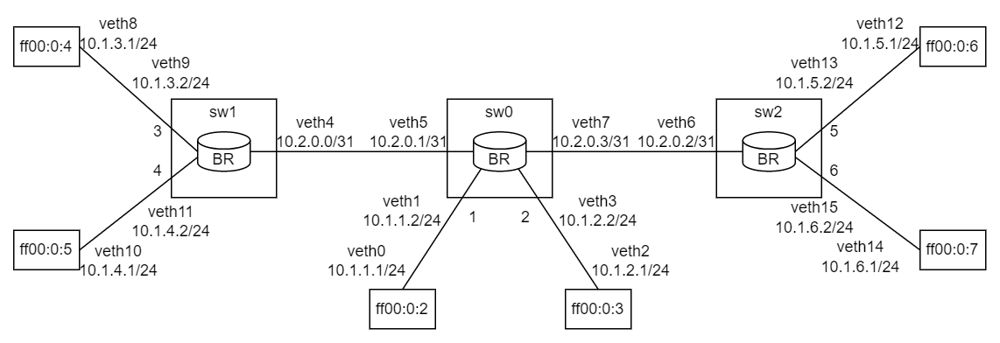

SCION Border Router in XDP BPF
==============================

This directory contains a SCION border router implemented in BPF. It is intended to be used in
conjunction with the regular SCION border router and provides an XDP fast-path for common packet
types.

The XDP border router consists of two pieces:
1. The actual XDP program in [src/bpf/xdp.c](src/bpf/xdp.c) and
2. a userspace "loader" application for loading and configuring the router in
  [src/br_loader.cpp](src/br_loader.cpp).

By default the router should be build in `build/br` under the repositories root directory. The
loader is called `br-loader` and the actual XDP kernel is compiled to `xdp_br.o`. To configure the
XDP border router, the loader requires a configuration file in TOML format and access to the
`topology.json` file generated by the `scion.sh` script distributed with SCION or provided by the
SCIONLab Coordinator.

### Configuration File Format
The BR configuration is a TOML file containing three keys:
- `self`: The "name" of the border router as it appears in SCION's configuration
  (e.g, "br1-ff00_0_1-1").
- `topology`: Path to the `topology.json` file.
- `internal_interfaces` a list of (IP, UDP port) pair to be considered as AS internal interfaces.
  At minimum this should contain the "internal_addr" of the BR as configured in `topology.json`.

See [test/br_config](test/br_config) for an example.

### Running the XDP border router
Invoke `br-loader` with the path to the compiled XDP program, the path to the configuration file and
one or more interface names to which the router should attach. For example:
```bash
sudo br-loader attach xdp_br.o config/br.toml eth0 eth1
```

At the moment, the XDP router has no way to obtain the keys necessary for hop field verification by
itself, so they must be set manually:
```bash
sudo br-loader key add br1-ff00_0_1-1 MTExMTExMTExMTExMTExMQ==
```
The 16-byte AES key is base64-encoded.

PTF Tests
---------
Some automated [Packet Test Framework](https://github.com/p4lang/ptf) tests are provided in
[test/](test/). Running [test/run_tests](test/run_tests) will create the following topology
containing three border routers and run some tests:



`run_tests` supports a number of command line arguments to switch to testing a single XDP router
and to stop the test topology setup or teardown early. Try 'run_tests -h'.
