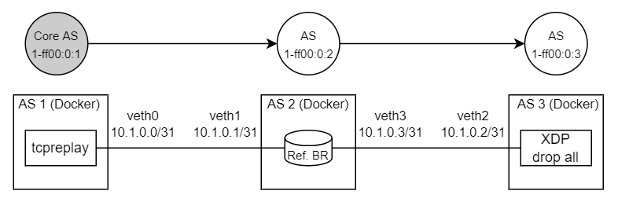

XDP Border Router Evaluation on Virtual Ethernet Devices (veths)
================================================================

To get a first impression of the performance of the XDP border router, we can attach it to virtual
ethernet links (veth devices) and replay captured or synthesized SCION traffic through it. In the
following, we will use this setup:


The XDP router is running inside the network namespace `br` which is connected to the global
namespace via two veth pairs. `tcpreplay` is used to send packets to the border router via
`veth0`, which the BR will forward to `veth2`, where a second XDP program counts the number of
received packets and drops them.

### Contents of this Directory
- [veth_setup.bash](./veth_setup.bash) Creates the network namespace and veth pairs.
- [veth_teardown.bash](./veth_teardown.bash) Removes the namespace and veths.
- [bridge_veths.bash](./bridge_veths.bash) Bridges veth1 and veth3 inside the network namespace.
- [gen_packets.py](./gen_packets.py) Scapy script for pre-generating test packets.
- [count_and_drop.py](./count_and_drop.py) BCC Python script for dropping packets in XDP.
  Prints the number of packets dropped per second for each CPU.
- [br_config/config.toml](br_config/config.toml) XDP-BR configuration.
- [br_config/config.toml](br_config/topology.json) Dummy SCION topology definition.
- [scion](scion/) Scripts and configuration for a small local SCION topology.
  - [eval](scion/eval) Topology generator script.
  - [topo.yaml](scion/topo.yaml) Topology definition for SCION.
  - [docker-compose.yaml](scion/docker-compose.yaml) Compose file defining the containers needed for
    the local SCION topology.
  - [br_config/config.toml](scion/br_config/config.toml) XDP-BR configuration.

Running this evaluation requires Scapy, tcpreplay, and [BCC](https://github.com/iovisor/bcc).

Standalone XDP BR
-----------------
The following commands were used to test the XDP BR independent of the other SCION services:
```bash
PROJECT_DIR=<root of the repository>
# Create virtual links
sudo ./veth_setup.bash
# Generate SCION packets (138 bytes each)
PYTHONPATH="$PROJECT_DIR/scapy-scion-int" ./gen_packets.py xdp_pkts.pcap
# Attach XDP border router
sudo $PROJECT_DIR/utils/netns.bash exec br \
    $PROJECT_DIR/build/br/br-loader attach $PROJECT_DIR/build/br/xdp_br.o br_config/config.toml \
    veth1 veth3
sudo $PROJECT_DIR/build/br/br-loader key add br1-ff00_0_1-2 0 "MjIyMjIyMjIyMjIyMjIyMg=="
# Drop all packets forwarded to veth2
sudo ./count_and_drop.py -i veth2
# In second terminal: Watch BR port statistics
sudo $PROJECT_DIR/utils/netns.bash exec br \
    $PROJECT_DIR/build/br/br-loader watch br1-ff00_0_1-2 veth1
# In third terminal: Send packets through the bridge
sudo tcpreplay -i veth0 --topspeed -K --loop=10000 xdp_pkts.pcap
# Detach XDP border router
sudo $PROJECT_DIR/utils/netns.bash exec br $PROJECT_DIR/build/br/br-loader detach veth1 veth3
# Delete veths
sudo ./veth_teardown.bash
```

Native Bridge
-------------
We have also measured the speed of a bridge between the two veths for comparison:
```bash
PROJECT_DIR=<root of the repository>
# Create virtual links
sudo ./veth_setup.bash
sudo ./bridge_veths.bash
# Generate SCION packets (138 bytes each)
PYTHONPATH="$PROJECT_DIR/scapy-scion-int" \
    ./gen_packets.py bridge_packets.pcap --dmac 02:00:00:00:00:02 --dst 10.1.0.2
# Drop all packets forwarded to veth2
sudo ./count_and_drop.py -i veth2
# In second terminal: Send packets through the bridge
sudo tcpreplay -i veth0 --topspeed -K --loop=10000 bridge_packets.pcap
# Delete veths when done
sudo ./veth_teardown.bash
```

Reference BR
------------
The reference border router requires an entire SCION AS to run, so we have to modify the evaluation
topology by introducing three "real" SCION ASes `1-ff00:0:1`, `1-ff00:0:2`, and `1-ff00:0:3`.
Each AS runs in a Docker container (see [docker-compose.yaml](scion/docker-compose.yaml)). The
connections between the ASes, or more specifically their border routers, are still provided by
veths.



AS 1-ff00:0:2 (or AS 2 for short) contains our border router under test. Since the generated SCION
configuration will use random interface IDs and MAC verification keys, we will modify and replay a
captured packet instead of creating packets from scratch. For the actual performance measurement, we
again drop all packets arriving at AS 3 before they even reach AS 3's border router. In AS 1,
packets are injected directly into veth0, bypassing AS 1's border router during the test.

### XDP BR in Docker
Using the same setup, we can also measure the XDP-BR's throughput in a more complex environment by
attaching it to the veth's used by the reference BR in AS 2.

```bash
PROJECT_DIR=<root of the repository>
# Create veths for testing
sudo ip link add veth0 type veth peer name veth1
sudo ip link add veth2 type veth peer name veth3
# Run local SCION topology
./scion/eval run veth0 veth1 veth2 veth3
# Ping AS3 from AS1
docker exec as1 bash -lc "scion ping 1-ff00:0:3,127.0.0.1"
# In second terminal: Capture SCION header with scapy and generate test packets
sudo ip netns exec as2 $PROJECT_DIR/scapy-scion-int/scapy_scion.py
p = sniff(iface="veth1",
    lfilter=lambda pkt: pkt.haslayer(SCMP) and pkt[SCMP].Type==128,
    prn=lambda pkt: pkt.summary(), count=1)[0]
p[SCION].remove_payload()
del p[IP].len
del p[IP].chksum
del p[UDP].len
del p[UDP].chksum
del p[SCION].NextHdr
del p[SCION].HdrLen
del p[SCION].PayloadLen
p /= UDP(sport=60000, dport=9)
wrpcap("packets.pcap", [p / Raw(i.to_bytes(4, byteorder='big')) for i in range(1000)])
quit()
# Stop ping command (Ctrl+C)
# Optional: Run BPF BR
## For veths: Packets will be dropped if checksum offload is not disabled
sudo ip netns exec as1 ethtool --offload veth0 rx off tx off > /dev/null
sudo ip netns exec as2 ethtool --offload veth1 rx off tx off > /dev/null
sudo ip netns exec as2 ethtool --offload veth3 rx off tx off > /dev/null
sudo ip netns exec as3 ethtool --offload veth2 rx off tx off > /dev/null
## For veths: Attach XDP programs to both sides of the veths
sudo ip netns exec as1 ip link set dev veth0 xdp object \
    $PROJECT_DIR/build/br/xdp_pass.c.o section xdp
sudo ip netns exec as3 ip link set dev veth2 xdp object \
    $PROJECT_DIR/build/br/xdp_pass.c.o section xdp # only if ./count_and_drop.py is not used
## Run BR in AS 2
docker exec -it -u root as2 bash
../bpf/br/br-loader attach ../bpf/br/xdp_br.o ../br_config/config.toml veth1 veth3
../bpf/br/br-loader key add br1-ff00_0_2-1 0 <key>
../bpf/br/br-loader watch br1-ff00_0_2-1 veth1 # show port statistics
../bpf/br/br-loader detach veth1 veth3 # detach XDP again when done
# Drop all packets forwarded to veth2 (in AS 2)
sudo ip netns exec as3 ./count_and_drop.py -i veth2
# In second terminal: Send packets
sudo ip netns exec as1 tcpreplay -i veth0 --topspeed -K --loop=10000 packets.pcap
# Cleanup
./scion/eval stop
./scion/eval clean
```

Results
-------
These results were obtained in a VM running Ubuntu 21.10 on an AMD Ryzen 3700X processor.

Packet size: 138 bytes

| Test                       | Throughput | Time per Packet |
|----------------------------|-----------:|----------------:|
| Direct veth0 <-> veth1     | 1.238 Mpps |        ~0.81 µs |
| Native bridge              | 0.685 Mpps |        ~1.46 µs |
| Standalone XDP BR with AES | 0.676 Mpps |        ~1.48 µs |
| Standalone XDP BR w/o AES  | 0.895 Mpps |        ~1.12 µs |
| Reference BR*              | 0.256 Mpps |        ~3.91 µs |
| XDP BR in Docker*          |    ~1 Mpps |           ~1 µs |

*) Packet generation offloaded to another CPU

Measuring veth throughput using tcpreplay and count_and_drop.py between veth0 and veth1 directly
yields a result of 1.238&nbsp;Mpps as upper bound for the maximum throughput we can expect from our
test. The native Ethernet bridge achieves a performance of 0.685&nbsp;Mpps. Our XDP BR can forward
SCION traffic at a rate of 0.676&nbsp;Mpps with hop field validation enabled. Disabling hop field
validation increases the throughput to 0.895&nbsp;Mpps.

Is is interesting to look at the difference in processing time between the border router with AES
support and without AES (and therefore no hop field validation). From the values above, the cost of
hop field validation can be computed as 1.48&nbsp;µs - 1.12&nbsp;µs = 0.36&nbsp;µs which is about
twice as much as the run time of our AES subroutine when compiled for native execution in userspace.

The first four tests were all limited to a single CPU core by the nature of our veth testbed, i.e.,
the same processor is sending packets on one veth, redirecting them to another veth and finally
dropping them. Utilization on that core was 100% during all four tests. The dockerized SCION
topology behaves differently, it forces tcpreplay in AS 1 to run on a different CPU core than the
BR under test, thus freeing up some more CPU time for the BR. Under these conditions the reference
BR achieved a throughput of 0.256&nbsp;Mpps. When we attach the XDP BR to support the reference BR
in AS 2, throughput increases to around 1&nbsp;Mpps -- a four times increase. It should be noted
that the reference BR alone was utilizing all CPUs to some extent with a total CPU utilization of
more than a single core, whereas the XDP-BR pinned a single CPU at exactly 100% utilization.
Additional testing will be required outside of a VM and on real Ethernet devices.
