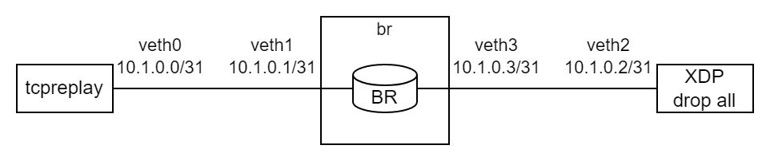

XDP Border Router Evaluation on Virtual Ethernet Devices (veths)
================================================================

To get a first impression of the performance of the XDP border router, we can attach it to virtual
ethernet links (veth devices) and replay captured or synthesized SCION traffic through it. In the
following, we will use this setup:



The XDP router is running inside the network namespace `br` which is connected to the global
namespace via two veth pairs. `tcpreplay` is used to send packets to the border router via
`veth0`, which the BR will forward to `veth2`, where a second XDP program counts the number of
received packets and drops them.

### Contents of this Directory
- [veth_setup.bash](./veth_setup.bash) Creates the network namespace and veth pairs.
- [veth_teardown.bash](./veth_teardown.bash) Removes the namespace and veths.
- [bridge_veths.bash](./bridge_veths.bash) Bridges veth1 and veth3 inside the network namespace.
- [gen_packets.py](./gen_packets.py) Scapy script for pre-generating test packets.
- [count_and_drop.py](./count_and_drop.py) BCC Python script for dropping packets in XDP.
  Prints the number of packets dropped per second for each CPU.

XDP SCION Forwarding
--------------------
The following commands were used to test the XDP BR:
```bash
PROJECT_DIR=<root of the repository>
# Create virtual links
sudo ./veth_setup.bash
# Generate SCION packets (138 bytes each)
PYTHONPATH="$PROJECT_DIR/scapy-scion-int" ./gen_packets.py xdp_pkts.pcap
# Attach XDP border router
sudo $PROJECT_DIR/utils/netns.bash exec br \
    $PROJECT_DIR/build/br/br-loader attach $PROJECT_DIR/build/br/xdp_br.o br_config/config.toml \
    veth1 veth3
sudo $PROJECT_DIR/build/br/br-loader key add br1-ff00_0_1-2 0 "MjIyMjIyMjIyMjIyMjIyMg=="
# Drop all packets forwarded to veth2
sudo ./count_and_drop.py -i veth2
# In second terminal: Watch BR port statistics
sudo $PROJECT_DIR/utils/netns.bash exec br \
    $PROJECT_DIR/build/br/br-loader watch br1-ff00_0_1-2 veth1
# In third terminal: Send packets through the bridge
sudo tcpreplay -i veth0 --topspeed -K --loop=10000 xdp_pkts.pcap
# Detach XDP border router
sudo $PROJECT_DIR/utils/netns.bash exec br $PROJECT_DIR/build/br/br-loader detach veth1 veth3
# Delete veths
sudo ./veth_teardown.bash
```

Bridge Performance
------------------
We have also measured the speed of a bridge between the two veths for comparison:
```bash
PROJECT_DIR=<root of the repository>
# Create virtual links
sudo ./veth_setup.bash
sudo ./bridge_veths.bash
# Generate SCION packets (138 bytes each)
PYTHONPATH="$PROJECT_DIR/scapy-scion-int" \
    ./gen_packets.py bridge_packets.pcap --dmac 02:00:00:00:00:02 --dst 10.1.0.2
# Drop all packets forwarded to veth2
sudo ./count_and_drop.py -i veth2
# In second terminal: Send packets through the bridge
sudo tcpreplay -i veth0 --topspeed -K --loop=10000 bridge_packets.pcap
# Delete veths when done
sudo ./veth_teardown.bash
```

Results
-------
These results were obtained in a VM running Ubuntu 21.10 on a AMD Ryzen 3700X processor.
Note that the entire test setup is running on a single core, i.e., the same processor is sending
packets through one veth, redirecting them to another veth and finally dropping them.

Packet size: 138 bytes

| Test                          | Throughput | Time per Packet |
|-------------------------------|-----------:|----------------:|
| Veth pair throughput          | 1.238 Mpps |        ~0.81 µs |
| Bridging two veth pairs       | 0.685 Mpps |        ~1.46 µs |
| XDP border router without AES | 0.895 Mpps |        ~1.12 µs |
| XDP border router with AES    | 0.676 Mpps |        ~1.48 µs |

Is is interesting to look at the difference in processing time between the border router with AES
support and without AES (and therefore no hop field validation). From the values above, it appears
the cost of the hop field validation is 1.48&nbsp;µs - 1.12&nbsp;µs = 0.36&nbsp;µs. However,
360&nbsp;ns seem unrealistic for encrypting a 16 byte AES block without hardware support, although
the fact that all verified hop fields are exactly the same might contribute to a higher than
expected performance.
